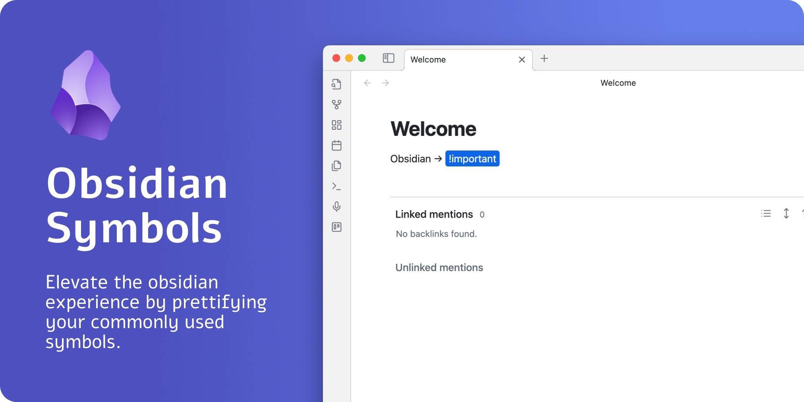

# Obsidian Symbols Prettifier



## What is it

Did you ever want to prettify your arrows or symbols, like `->` or `<=>`?

With the help of this plugin, it is easier than ever before. This plugin allows you to prettify several character combinations so that these combinations do not look like cryptic symbols.

## How to use

The easiest way to use the plugin is to install it and then try to type the following symbols. All of these symbols will be prettified:

`->`, `<-`, `<->`, `<=>`, `<=`, `=>`

## Development

To customize this project for your needs, you can clone it and then install all dependencies:
```sh
$ git clone https://github.com/FlorianWoelki/obsidian-symbols-prettifier
$ cd obsidian-symbols-prettifier
$ yarn
```

After the installation, you need to create a `env.mjs` file in the root directory. Fill the file with the following content:

```js
export const obsidianExportPath =
  '<path-to-obsidian-vault>/.obsidian/plugins/obsidian-symbols-prettifier';
```

Afterward, you can start the rollup dev server by using:

```sh
$ yarn dev
```

This command will automatically build the necessary files for testing and developing every change. Furthermore, it copies all the essential files to the specified plugin directory.

Finally, you can customize the plugin and add it to your plugins.
